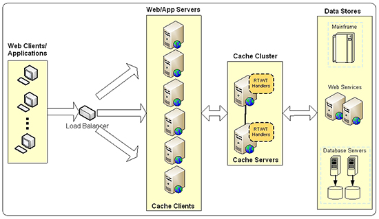

# Caching

Caching is a technique that stores a copy of a given resource and serves it back when requested. Caching is used to improve the latency of a system and can be used in many different points/layers within a system.

A cache's primary purpose is to increase data retrieval performance by reducing the need to access the underlying slower storage layer. The data in a cache can be stored in fast access hardware such as RAM to avoid pulling from slower places like HD or redownloading the resource from the originating server.

- https://www.ehcache.org/documentation/2.7/apis/write-through-caching.html#write-through-and-write-behind-caching-with-the-cachewriter-
- https://redisson.org/glossary/write-through-and-write-behind-caching.html

## Browser Cache (Client Level)

Browser caching is the process by which a web browser saves website resources in order to load them quickly during the next client request. You can see it in action when you load a web page with a background image for example. The first time you load the page, the image gets saved in your browser cache. The next time you visit the page, you will notice that the page loads faster and latency is reduced. This is because the browser is not requesting the image again from the web server. Instead it is loading the image from your local files.

Cache-Control is an HTTP cache header that contains a set of parameters to define the browser’s caching policies in the client requests and server responses. When a client makes a request to the server, the browser can cache, or store copies of resources for faster access and lower latency. This means that when the browser has to receive these files again, it doesn’t need to make a request to the web server again. Cache-Control specifies when and how a response should be cached and for how long.

## Server Cache

- Server can cache data from requests to database so that it doesn't have to keep going back to the database when an identical request is made in the near-future

- Industry std - Redis

- You can also have caching that happens in between at the proxy level (basically between any two components in the full network stack)

## Algorithmic Cache

- Store data for computationally heavy (slow time complexity) data to save time in the future

## Local Server Caching (In-Memory)

Service caches can be implemented either in memory or external to the service. On-box caches, commonly implemented in process memory, are relatively quick and easy to implement and can provide significant improvements with minimal work. On-box caches are often the first approach implemented and evaluated once the need for caching is identified. In contrast to external caches, they come with no additional operational overhead, so they are fairly low-risk to integrate into an existing service. We often implement an on-box cache as an in-memory hash table that is managed through application logic (for example, by explicitly placing results into the cache after the service calls are completed) or embedded in the service client (for example, by using a caching HTTP client).

Despite the benefits and seductive simplicity of in-memory caches, they do come with several downsides. One is that the cached data will be inconsistent from server to server across its fleet, manifesting a cache coherence problem. If a client makes repeated calls to the service they might get newer data used in the first call and older data in the second call, depending on which server happens to handle the request.

Another shortcoming is that the downstream load is now proportional to the service's fleet size, so as the number of servers grows it still may be possible to overwhelm dependent services. We’ve found that an effective way to monitor this is to emit metrics on cache hits/misses and the number of requests made to downstream services.

In-memory caches are also susceptible to “cold start” issues. These issues occur where a new server launches with a completely empty cache, which could cause a burst of requests to the dependent service as it fills its cache. This can be a significant issue during deployments or in other circumstances in which the cache is flushed fleet-wide. Cache coherence and empty cache issues can often be addressed by using request coalescing, which is described in detail later in this article.

## External Caching

External caches can address many of the issues we’ve just discussed. An external cache stores cached data in a separate fleet, for example using Memcached or Redis. Cache coherence issues are reduced because the external cache holds the value used by all servers in the fleet. (Note that these issues aren’t totally eliminated because there might be failure cases when updating the cache.) Overall load on downstream services is reduced compared to in-memory caches and isn’t proportional to fleet size. Cold start issues during events like deployments are not present since the external cache remains populated throughout the deployment. Finally, external caches provide more available storage space than in-memory caches, reducing occurrences of cache eviction due to space constraints.

However, external caches come with their own set of shortcomings to consider. The first is an increased overall system complexity and operational load, since there is an additional fleet to monitor, manage, and scale. The availability characteristics of the cache fleet will be different from the dependent service it is acting as a cache for. The cache fleet can often be less available, for example, if it doesn’t have support for zero-downtime upgrades and if it requires maintenance windows.

- https://aws.amazon.com/builders-library/caching-challenges-and-strategies/

## External Database Caching Strategies

The more information you have in a database, the slower it will become over time. Even database management systems that are well-designed to support many concurrent requests will eventually hit their limit.

Database caching is one of the most common strategies for dealing with these performance issues. Caching involves saving the results of database queries in a location that is faster and easier to access. When done correctly, caching will slash query response times, decrease the load on your databases, and cut costs.

However, caches also need to be handled with care because they essentially make another copy of your information in a separate location. Keeping both the database and the cache synchronized and up-to-date can be a trickier challenge than you anticipated. In the next section, we'll discuss some of the most common database caching strategies.

There are two main ways people use a distributed cache:

- Cache-aside: This is where application is responsible for reading and writing from the database and the cache doesn't interact with the database at all. The cache is "kept aside" as a faster and more scalable in-memory data store. The application checks the cache before reading anything from the database. And, the application updates the cache after making any updates to the database. This way, the application ensures that the cache is kept synchronized with the database.

- Read-through/Write-through (RT/WT): This is where the application treats cache as the main data store and reads data from it and writes data to it. The cache is responsible for reading and writing this data to the database, thereby relieving the application of this responsibility.

### Read-through

In read-through caching, the application first queries the cache to see if the information it needs is inside. If not, it retrieves the information from the database and uses it to update the cache. The cache provider or cache library is responsible for the detailed logic of querying and updating the cache.

The read-through strategy works best for read-heavy workloads when the application requests the same data repeatedly: for example, a news website that loads the same articles over and over.

One downside of the read-through strategy is that the first query to the cache will always result in a miss because the requested information is guaranteed not to be inside. To deal with this issue, developers often "warm" the cache ahead of time with information that users are likely to request.

### Write-through

Write-through caching is a caching strategy in which the cache and database are updated almost simultaneously (in the same operation). When we want to update the information in the cache, we first update the cache itself, and then propagate the same update to the underlying database.

The use of write-through caching helps guarantee that your data is consistent between the cache and the database. Write-through caching is best when you expect to perform update operations relatively infrequently. If you perform updates too many times while using write-through caching, then this reduces the benefits of having a cache in the first place, since you will need to access the database anyway.

Write-through caching is especially helpful when you want to guard against system failures, such as power outages or crashes. If the system goes down while using write-through caching, it’s very likely that the data in the cache and the database will be identical once the system recovers, since updates are made almost instantaneously.

### Write-back or Write-behind

Write-behind caching is a caching strategy in which the cache is updated first, and then the database is updated after a set period of time.

The use of write-behind caching is more convenient when you expect to have a write-heavy workload, i.e. you expect to perform many cache updates. Write-behind caching improves system performance because the user does not (usually) have to wait for changes to be made to the database.

As long as the time limit is not too long, write-behind caching may still deliver acceptable protection from system failures. However, the risk of data loss is greater when using write-behind caching. If the system goes down, any changes to the cache data may not have yet been sent to the database.

The major benefit of write-behind is database offload. This can be achieved in a number of ways:

- Time-shifting: Moving writes to a specific time or time interval. For example, writes could be batched up and written overnight, or at 5 minutes past the hour, to avoid periods of peak contention.
- Rate-limiting: Spreading writes out to flatten peaks. Say a Point of Sale network has an end-of-day procedure where data gets written up to a central server. All POS nodes in the same time zone will write all at once. A very large peak will occur. Using rate limiting, writes could be limited to 100 TPS, and the queue of writes are whittled down over several hours.
- Conflation: Consolidate writes to create fewer transactions. For example, a value in a database row is updated by 5 writes, incrementing it from 10 to 20 to 31 to 40 to 45. Using conflation, the 5 transactions are replaced by one to update the value from 10 to 45.
- https://vimeo.com/21193026

### Write-behind vs Write-through

In general, write-through caching is easier to implement than write-behind caching for several reasons.

First, in order to successfully implement write-behind caching, all parts of the system must first make changes to the cache before changing the database, as well as check the cache before accessing the database. Otherwise, the system could miss the “dirty” records stored in the cache that have not yet been sent to the database.

Second, to improve performance, write-behind caching uses a technique known as conflation, in which changes to the cache are consolidated in order to limit the number of transactions needed to update the database. For example, if a value is changed from 1 to 2 in the cache, and then later from 2 to 3, the database will only be updated to change the value from 1 to 3.

### Read-Through/Write-Through

  

### Read-Through and Write-behind Cache

For applications that are not tolerant of inconsistency, the simplest solution is for the application to always read through the same cache that it writes through. Provided all database writes are through the cache, consistency is guaranteed.

- Lazy Loading: The entire data set does not need to be loaded into the cache on startup. A read-through cache uses a CacheLoader that loads data into the cache on demand. In this way the cache can be populated lazily.

- Caching of a Partial Dataset: If the entire dataset cannot fit in the cache, then some reads will miss the cache and fall through to the CacheLoader which will in turn hit the database. If a write has occurred but has not yet hit the database due to write-behind, then the database will be inconsistent. The simplest solution is to ensure that the entire dataset is in the cache. This then places some implications on cache configuration in the areas of expiry and eviction.

- Eviction: Eviction or flushing of elements, occurs when the maximum elements for the cache have been exceeded. Be sure to size the cache appropriately to avoid eviction or flushing.

- Expiry: Even if all of the dataset can fit in the cache, it could be evicted if Elements expire. Accordingly, both timeToLive and timeToIdle should be set to eternal to prevent this from happening.

## Handling Stale Data

Eviction policies:

- Least Recently Used (LRU)
- LIFO
- FIFO

## Home

- [Home](./README.md)
