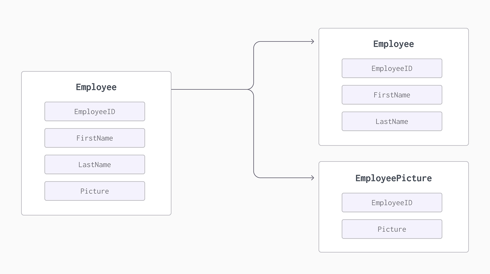

# Database Sharding & Partitioning

Sharding (horizontal) and partitioning (vertical) are both related to breaking up a large data set into smaller subsets. The difference is that sharding implies the data is spread across multiple computers while partitioning does not.

## Database Partitioning (Vertical)

Partitioning is the database process where very large tables are divided into multiple smaller parts (table will have less columns). By splitting a large table into smaller, individual tables, queries that access only a fraction of the data can run faster because there is less data to scan. The main goal of partitioning is to aid in maintenance of large tables and to reduce the overall response time to read and load data for particular SQL operations.

  

## Database Sharding (Horizontal)

Sharding is actually a type of database partitioning, more specifically, Horizontal Partitioning. Sharding, is replicating or copying the schema, and then dividing the data based on a shard key onto a separate database server instance, to spread load.

A table’s shard key determines in which partition a given row in the table is stored. When you run an INSERT query, the node computes a hash function of the values in the column or columns that make up the shard key, which produces the partition number where the row should
be stored. The node then directs the INSERT operation to the appropriate node machine and partition.

- https://www.youtube.com/watch?v=5faMjKuB9bc&list=PLMCXHnjXnTnvo6alSjVkgxV-VH6EPyvoX&index=7

## Home

- [Home](./README.md)
