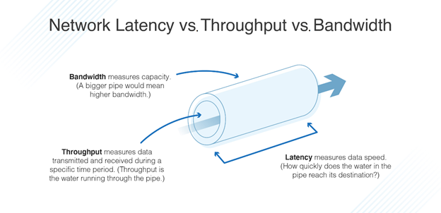

# Measuring Network/System Performance

1. [Bandwidth](#Bandwidth)
2. [Throughput](#Throughput)
3. [Latency](#Latency)

  

- Bandwidth: (b/s)
- Throughput: (b/s)
- Latency: (ms)

## Bandwidth

Bandwidth measures the amount of data that is able to pass through a network at a given time (typically measured in b/s)

## Throughput

In a network, bandwidth availability determines the number of data packets that can be transmitted and received during a specific time period, while throughput informs you of the number of packets actually sent and received.

## Latency

Latency refers to the delay that happens between when a user takes an action on a network or web application and when it reaches its destination, which is measured in milliseconds.

Latency is a result of a combination of throughput and bandwidth. It refers to the amount of time it takes data to travel after a request has been made. With more or less bandwidth or throughput, latency increases or decreases accordingly.

Considerations:

- Distance data has to travel
- Transmission medium (e.g. copper wiring vs. fiber optics)
- Individual component latency (e.g. routers)
- Storage delays (retrieving data from storage)

Some ways to improve latency:

- Use a Content Delivery Network (CDN)

  - With a CDN you gain the ability to cache content. With caching, certain content that will be needed is kept, so it can be accessed on-demand without having to obtain it from the original server. This is done using a CDN server.

  - CDN servers can be placed in various locations strategically to ensure content is stored in close proximity to end-users and their devices. In this way, the data packets do not have to travel as far after a request is made. As a result, the website delivering the content is able to load faster, and content reaches its final destination sooner.

- Reduce file sizes/optimize images and cut down on resources that block rendering

- Lazy Loading: you can also set up a website so it only loads the assets that are needed in the moment.

## Home

- [Home](./README.md)
